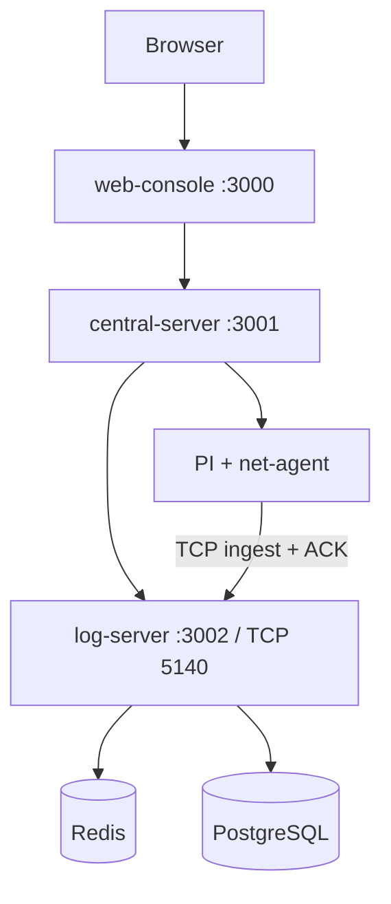

# INSLAB Testbed Middleware Console Architecture

이 문서는 저장소의 서비스 경계와 데이터 흐름만 짧게 설명합니다. 실행 방법과 환경변수는 루트 [`README.md`](/Users/lsh/INSLAB-TESTBED-MIDDLEWARE-CONSOLE/README.md)를 기준으로 확인합니다.

## Overview

현재 구조의 핵심 원칙은 다음과 같습니다.

- 원시 네트워크 메트릭은 PI에서 직접 수집합니다.
- `log-server`가 로그와 네트워크 메트릭의 원천 저장소입니다.
- `central-server`는 제어면과 프록시 역할을 맡습니다.
- `web-console`은 표시와 운영 인터페이스만 담당합니다.

## Runtime Topology

## Service Boundaries

### `clients/net-agent`

- 각 PI에서 실행되는 C 기반 에이전트
- `/proc/net/dev`를 읽어 인터페이스 샘플 생성
- 로컬 스풀 파일 유지
- `log-server` TCP ingest 포트로 전송

### `apps/log-server`

- `NestJS + Prisma + PostgreSQL + Redis`
- 로그와 네트워크 메트릭 ingest 담당
- Redis 큐를 통해 write burst를 흡수한 뒤 PostgreSQL에 적재
- 조회 API 제공

주요 엔드포인트:

- `GET /api/health`
- `GET /api/logs`
- `POST /api/net-metrics/ingest`
- `GET /api/net-metrics/:nodeId/latest`
- `GET /api/net-metrics/:nodeId/history`

### `apps/central-server`

- `Express + SQLite + ws + ssh2`
- PI 등록/수정/삭제
- SSH 터미널 프록시
- PI 상태 점검
- 토폴로지 API
- `log-server` API 프록시

중요:

- `central-server`는 네트워크 메트릭의 원천 저장소가 아닙니다.
- 원시 시계열의 source of truth는 `log-server` PostgreSQL입니다.

### `apps/web-console`

- `Next.js 14`
- 대시보드, Pi 관리, 토폴로지, 로그, 네트워크 UI 제공
- `central-server`의 HTTP/WebSocket API를 사용

## Data Flows

### Network Metrics

1. `net-agent`가 PI에서 인터페이스 샘플을 수집합니다.
2. 샘플을 로컬 스풀에 기록합니다.
3. `log-server` TCP receiver가 Redis ingest 큐에 적재합니다.
4. background worker가 Redis 큐를 batch로 소비합니다.
5. PostgreSQL `network_interface_samples` 테이블에 저장합니다.
6. `central-server`가 조회 API를 프록시합니다.
7. `web-console`이 이를 표시합니다.

### Logs

1. 로그 payload가 `log-server`로 들어옵니다.
2. Redis ingest 큐를 거쳐 PostgreSQL `logs` 테이블에 저장됩니다.
3. `central-server /api/logs`가 이를 프록시합니다.
4. `web-console` 로그 화면이 조회합니다.

## Storage

### `central-server` SQLite

저장:

- PI 등록 정보
- 운영 설정
- 토폴로지 관련 메타데이터

저장하지 않음:

- 원시 로그 데이터
- 네트워크 메트릭 시계열

### `log-server` PostgreSQL

주요 테이블:

- `logs`
- `network_interface_samples`

### `log-server` Redis

역할:

- ingest 버퍼
- 비동기 DB flush 전 임시 큐

## Operational Notes

- `net-agent`의 `NODE_ID`는 `central-server`에 등록된 PI `id`와 일치해야 합니다.
- 외부 배포 시 `log-server`의 HTTP 포트와 TCP ingest 포트 접근 정책을 분리해서 관리해야 합니다.
- 현재 UI와 `central-server`는 폴링과 WebSocket을 혼합 사용합니다.
- 수집 직후 `latest` 조회에는 Redis -> worker -> PostgreSQL 플러시 지연이 소폭 존재할 수 있습니다.
