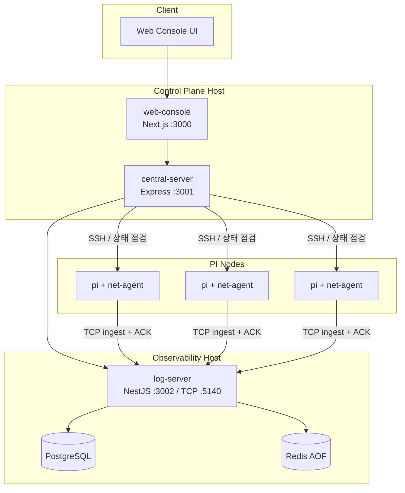

# INSLAB Testbed Middleware Console - 아키텍처 문서

이 문서는 현재 작업 브랜치 기준의 Middleware Console 아키텍처를 설명합니다. 핵심 변화는 네트워크 부하의 원천 수집 책임이 `central-server`에서 `PI net-agent + log-server` 조합으로 이동했다는 점입니다.

## 1. 개요

Middleware Console은 Raspberry Pi 테스트베드의 상태, 터미널 접속, 토폴로지, 로그, 네트워크 부하를 중앙에서 관리하는 시스템입니다.

현재 아키텍처의 원칙은 다음과 같습니다.

- PI에서 직접 측정한 데이터를 서버로 보낸다.
- `log-server`가 원시 관측 데이터의 저장소가 된다.
- `central-server`는 제어와 프록시, 가공 API 역할을 맡는다.
- `web-console`은 수집하지 않고 표시한다.

## 2. 시스템 구성



## 3. 컴포넌트 책임

### 3.1. `clients/net-agent`

- 각 PI에서 실행되는 C 기반 수집기
- `/proc/net/dev`를 읽어 인터페이스별 RX/TX 카운터와 delta를 계산
- 샘플을 로컬 NDJSON 스풀에 먼저 기록
- 원격 `log-server`에 TCP로 전송
- 서버 `ACK`를 받은 샘플만 스풀에서 커밋
- 스풀 한도 초과 시 가장 오래된 미전송 샘플부터 제거

### 3.2. `apps/log-server`

- 독립 배포 가능한 원격 수집 서버
- 스택: `NestJS + Prisma + PostgreSQL + Redis`
- TCP ingest 포트 `5140`
- HTTP API 포트 `3002`
- 역할:
  - 로그 수집
  - 네트워크 메트릭 수집
  - Redis 큐를 통한 ingest 버퍼링
  - PostgreSQL 영속화
  - 조회 API 제공

주요 엔드포인트:

- `GET /api/health`
- `GET /api/logs`
- `POST /api/net-metrics/ingest`
- `GET /api/net-metrics/:nodeId/latest`
- `GET /api/net-metrics/:nodeId/history`

### 3.3. `apps/central-server`

- 시스템 제어 허브
- 스택: `Express + SQLite + ssh2 + ws`
- 역할:
  - PI 등록/수정/삭제
  - SSH 터미널 프록시
  - PI 상태 점검
  - 토폴로지 계산
  - `log-server` API 프록시

중요한 점:

- `central-server`는 더 이상 네트워크 부하의 직접 수집자가 아니다.
- 네트워크 통계의 source of truth는 `log-server`이다.

### 3.4. `apps/web-console`

- 사용자 인터페이스
- 스택: `Next.js 14 + React`
- 역할:
  - PI 상태 대시보드
  - 네트워크 부하 카드와 상세 패널
  - 로그 조회 화면
  - SSH 터미널 화면
  - 토폴로지 시각화

## 4. 네트워크 부하 데이터 흐름

### 4.1. PI 수집

1. `net-agent`가 `SAMPLE_INTERVAL_SEC` 주기로 `/proc/net/dev`를 읽는다.
2. `lo`를 제외한 인터페이스별 누적 바이트/패킷 카운터를 파싱한다.
3. 직전 샘플과 차이를 계산해 `rxBps`, `txBps`, `rxPps`, `txPps`를 구한다.
4. 샘플을 로컬 스풀 파일에 append 한다.

### 4.2. 전송과 신뢰성

1. `net-agent`가 스풀의 미전송 라인을 TCP로 `log-server:5140`에 전송한다.
2. `log-server`가 유효한 샘플이면 Redis ingest 큐에 넣고 `ACK`를 반환한다.
3. `net-agent`는 `ACK`를 받은 경우에만 커밋 오프셋을 전진시킨다.
4. 서버 장애 시 스풀에 계속 적재된다.
5. 스풀 상한을 넘으면 오래된 샘플부터 드롭한다.

### 4.3. 서버 적재

1. `log-server` TCP receiver가 Redis 큐에 push 한다.
2. worker가 Redis 큐를 batch로 읽는다.
3. Prisma를 통해 PostgreSQL `network_interface_samples` 테이블에 적재한다.
4. 조회 API는 최신값과 히스토리를 제공한다.

### 4.4. 표시

1. `web-console`이 `central-server /api/net-stats/...`를 호출한다.
2. `central-server`가 `log-server /api/net-metrics/...`를 프록시한다.
3. UI는 5초 폴링으로 카드와 상세 패널을 갱신한다.

## 5. 로그 데이터 흐름

- 로그 수집도 동일하게 `log-server`가 원천 저장소 역할을 맡는다.
- `central-server /api/logs`는 `log-server /api/logs`를 프록시한다.

즉 현재 구조는 다음처럼 해석해야 합니다.

- 로그 경로: `PI -> log-server -> central-server -> web-console`
- 네트워크 경로: `PI net-agent -> log-server -> central-server -> web-console`

## 6. 데이터 저장소

### 6.1. `central-server` SQLite

저장 대상:

- PI 등록 정보
- 중앙 서버 운영 메타데이터
- 토폴로지 관련 설정

저장하지 않는 것:

- 네트워크 부하 시계열 원본
- 원시 로그 수집 데이터

### 6.2. `log-server` PostgreSQL

주요 테이블:

- `logs`
- `network_interface_samples`

`network_interface_samples` 주요 컬럼:

- `node_id`
- `iface`
- `timestamp`
- `seq`
- `rx_bytes`
- `tx_bytes`
- `rx_packets`
- `tx_packets`
- `rx_bps`
- `tx_bps`
- `rx_pps`
- `tx_pps`
- `agent_version`
- `received_at`

### 6.3. `log-server` Redis

역할:

- ingest 버퍼
- PostgreSQL 적재 전 임시 큐

현재 설정:

- AOF 활성화
- 컨테이너 재시작 시 큐 복구 가능

## 7. Docker 배포

루트 `docker-compose.yml` 기준으로 다음 컨테이너를 함께 띄웁니다.

- `central-server`
- `web-console`
- `log-server`
- `log-db` (PostgreSQL)
- `log-redis` (Redis AOF)

실행:

```sh
docker compose up --build
```

독립 `log-server`만 띄우려면:

```sh
docker compose -f apps/log-server/docker-compose.yml up --build
```

## 8. 운영상 주의점

- `net-agent`의 `NODE_ID`는 `central-server`에 등록된 PI의 `id`와 일치해야 한다.
- `log-server`를 다른 호스트에서 돌릴 수 있으므로 방화벽에서 `3002`, `5140` 접근 정책을 명확히 해야 한다.
- `log-server`는 Prisma 7 + `@prisma/adapter-pg` 조합으로 PostgreSQL에 직접 연결한다.
- PI 수가 늘어나면 PostgreSQL retention/downsampling 전략을 추가해야 한다.
- 현재 ingest는 `Redis -> background worker -> PostgreSQL` 비동기 플러시 구조다. 따라서 수집 직후 `latest` 조회에는 짧은 지연이 있을 수 있다.
- 현재 UI는 5초 폴링이다. 필요하면 이후 `log-server -> central-server -> web-console` WebSocket 경로로 확장할 수 있다.

## 9. 현재 작업 브랜치 기준 미완료 항목

- `web-console` 실시간 WebSocket 갱신
- 장기 보관용 downsampling 정책
- `net-agent` 패키징 자동화
- 에이전트 인증 및 TLS
